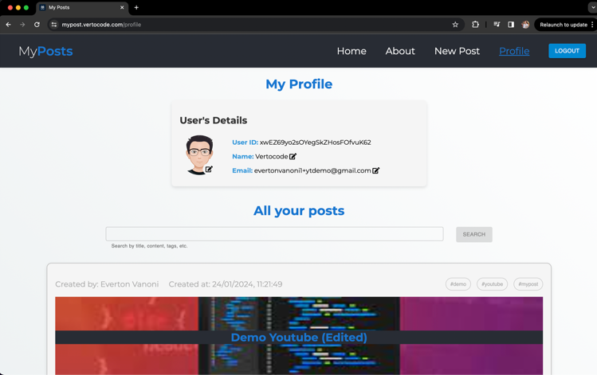

# [MyPosts](https://mypost.vertocode.com)

This project is a platform where anyone can create their own blog and share their thoughts with 
the world. The project was built using React and Firebase. 

[Demo Video](https://www.youtube.com/watch?v=keI4PW1J_2Q)




## Features

The application offers a wide range of features including:
- ✔️ Signup page with various validations
- ✔️ Account verification emails for account creation or change of email
- ✔️ Signin page with various validations
- ✔️ Homepage displaying a list of posts from anyone
- ✔️ About page to learn more about the project 
- ✔️ New Post page to create a new post with title, image of header, select the color of texts, tags, and more 
- ✔️ Edit Post page to edit an existing post 
- ✔️ Profile page to edit user's information, add a profile photo, and see the posts created by the user 
- ✔️ Delete an existing post if logged in as the creator 
- ✔️ Search for posts by title, tags, or author

## Technologies

The project was built using the following technologies:
- React
- TypeScript
- SASS
- Firebase
- React Router
- Vite
- React Hook Form
- ESLint
- Vercel
- Yarn

## Installation

To run the project locally, you need to have Node.js and yarn installed on your machine. 
Then, you can clone the repository and install the dependencies using the following commands:

```bash
git clone git@github.com:vertocode/my-posts.git
cd my-posts
yarn
```

After installing the dependencies, you need to create a Firebase project and enable the following services:
- Authentication
- Cloud Firestore
- Cloud Storage
- Cloud Functions

Then, you need to create a `.env` file in the root directory of the project and add the following variables:

```bash
VITE_FIREBASE_API_KEY=
VITE_FIREBASE_AUTH_DOMAIN=
VITE_FIREBASE_PROJECT_ID=
VITE_FIREBASE_STORAGE_BUCKET=
VITE_FIREBASE_MESSAGING_SENDER_ID=
VITE_FIREBASE_APP_ID=
VITE_FIREBASE_MEASUREMENT_ID=
```

Finally, you can run the project using the following command:

```bash
yarn dev
```

## License

This project is licensed under the MIT License - see the [LICENSE.md](LICENSE.md) file for details.
